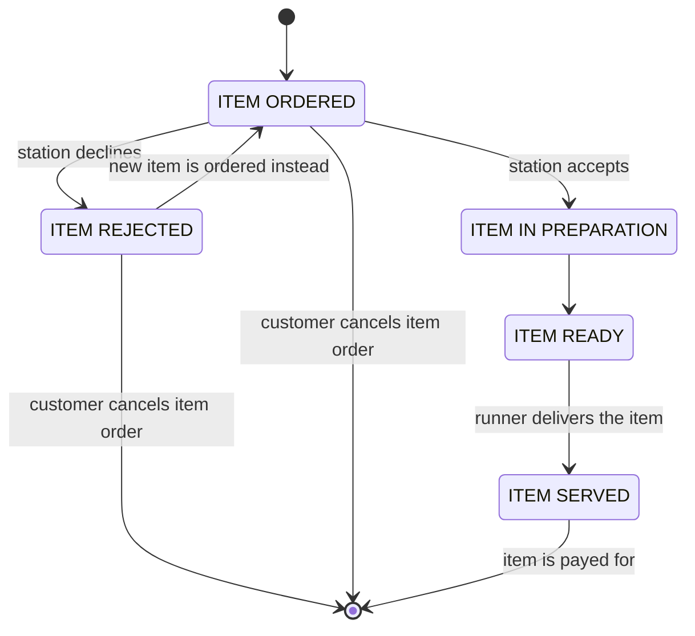

# Project 3 Planning

## Scope

An order/table management system for a [casual dining](https://en.wikipedia.org/wiki/Types_of_restaurant#Casual_dining) restaurant that is intended to optimise the restuaurant's food-serving operations.

The real-life quantity or metric that the app attempts minimize is the time it takes from the moment the customer is seated until they are served, called the _sit-to-serve time_.

### Core Mission

The core mission of the application is to manage the lifecycle of the order items.

An order item is "placed" when the customer orders a menu item, it is "ready" when the item has been prepared, and it is "served" when it is at the table (the terminal and desired end state for such an item).

### Side Mission

An important side mission of the application is to manage the lifecycle of tables.

A table is "idle" when it is available for customers, it is "occupied" when there are people by it, "needs cleaning" when it is no longer occupied but needs cleaning, etc.

It is unclear if the design should support bookings, at this stage, in which case more states will be required.

## Background

The _sit-to-serve time_ is composed of:
1. The time it takes for the customer to have access to a waiter/waitress for ordering
2. The time it takes the waiter/waitress to decide the menu item that needs to be ordered
3. The time it takes for the order item information to be transmitted to the right production stations
4. If the production station is able to fullfill the order, then the remaining breakdown is:
  - The time it takes for the production station to make the food/drink
  - The time it takes for the order item to be picked up and delivered to the table
5. If the production station is unable to fullfill the order, then the remaining breakdown is:
  - The time it takes for the production station to communicate the inability to fulfill the order item to the waiter/waitress
  - The time it takes for the waiter/waitress to communicate this to the customer and decide what to do next
  - If the customer decided not to order anything as a result, the breakdown stops here.
  - If a new order item is requested instead, which can be fulfilled, then the remaining breakdown is:
    * The time it takes for the production station to make the food/drink
    * The time it takes for the order item to be picked up and delivered to the table
  - If a new order item is requested instead, which also cannot be fulfilled, then the remaining breakdown is recursive and unpredictable, and basically follows the breakdown of point (5) above.

## Approach

We agreed to try to solve problems in the domain, and understand that some discussions in the team will target restaurant operations, rather not just coding and fullstack development.

### Restaurant type

Considering the many variations in restaurant types and service, which are nicely explained [on Wikipedia](https://en.wikipedia.org/wiki/Types_of_restaurant). We chose to target the _casual dining_ (also called the sit-down restaurant) type, for being a representative of the most common type of restaurant encountered.

This assumption will simplify a lot of the design decisions and make it possible to build a relevant MVP (more on this next).

### Implementation strategy

In the first phase we aim solely for an MVP (a _Minimum Viable Product_) meaning that anything that does not fit the core mission statement above will be dropped initially until a fully functional, but a minimal, application is achieved.

### Cloud-based vs. LAN-based

TODO: on-going discussion

## Design

### User roles

_TODO: who will use this application_

> Suggestion:
> 1. Waiter/waitress/self-service/cashier (anyone ordering food, usually they also serve the food)
> 2. Barista/barman/waiter (anyone serving drinks)
> 3. Cheff (anyone making food)
> 4. Runners (anyone picking up the food and taking it to the table)

### Order States

_TODO: do we need a state machine for the order itself? probably not_

### Order-item States

### Table States

_TODO: using a state diagram in markdown and later using an XSTATE library visualizer_
### Signup Sequences

_TODO: a sequence diagram showing the steps needed to make an account_
